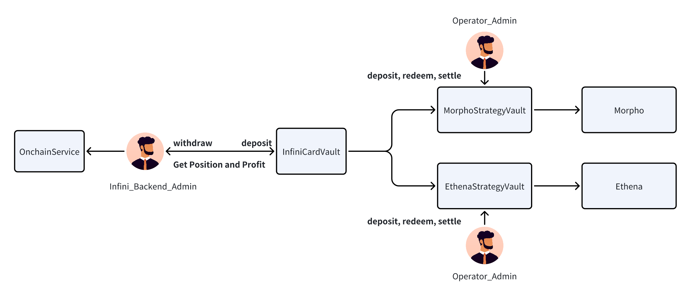

# InfiniCard Vault
## Overview
InfiniCard Vault is a centrally managed contract platform designed to efficiently manage and grow assets through various strategies. The platform supports multiple strategies, including Ethena, Morpho, etc.., allowing Infini Card Service to deposit, withdraw, and settle profits. 

## Contract Structure
### Main Contracts



1. InfiniCardVault.sol
   - The primary asset management contract responsible for adding strategies, investing assets, and redeeming assets.
2. InfiniCardController.sol
   - The controller contract that manages the whitelist of strategies and custodians.
3. InfiniEthenaStrategyVault.sol
   - The Ethena strategy contract, inheriting from BaseStrategyVault, implements the specific deposit and redeem operations for the Ethena strategy.
4. InfiniMorphoStrategyVault.sol
   - The Morpho strategy contract, inheriting from BaseStrategyVault, implements the specific deposit and redeem operations for the Morpho strategy.


## Core Vault InfiniCardVault
nfiniCardVault is a contract designed for backend integration, allowing backend operations such as deposits and withdrawals through this contract.
### DepositToVault
The administrator will transfer money directly from the CEX to the InfiniCardVault contract. Then the strategy administrator will call the investment function to transfer the tokens to the corresponding strategy contract.

```solidity
IERC20(token).TransferFrom(CEX, Vault, amount)
```


### WithdrawToCEX
When the Admin needs to withdraw funds from InfiniCardVault to the CEX, the WithdrawToCEX function will be called.

```solidity
    function withdrawToCEX(
        address token,
        uint256 amount,
        address custodian,
        address strategy
    ) onlyRole(INFINI_BACKEND_ROLE) external returns(uint256 actualAmount) {
        _isTokenValid(token);
        _isCusdianValid(custodian);
        actualAmount = amount;

        // if balance is not enough, try to withdraw from strategy
        if( !_isBalanceEnough(address(this), token, amount)) {
            if (strategy == address(0)) {
                revert StrategyNotSet();
            }

            address underlyingToken = IStrategyVault(strategy).underlyingToken();
            if(underlyingToken != token) {
                revert TokenMismatch();
            }

            // amount maybe changed (less than requested, due to slippage/fee/etc.), 
            // so we use actualGetAmount to withdraw
            actualAmount = _withdraw_from_strategy(strategy, amount);
        }

        _transferAsset(token, actualAmount, custodian);

        emit WithdrawAssetToCustodian(token, actualAmount, custodian, strategy);
    }
```

## Core Strategy Vault

In order to isolate risks, each Strategy is a separate vault to store funds. Different strategies have different logics.
### 1. MorphoVault

MorphoVault is a vault for managing morpho policies. The core methods are:
1) deposit
Put the underlying Token into Morpho's Vault and increase the vaultPosition. (The vaultPosition will be used when calculating position and profit).


```solidity

    function deposit(uint256 amount) virtual external override  onlyRole(INFINI_CARD_VAULT) {
        if ( getBalance(underlyingToken) < amount ) revert UnderlyingTokenIsNotEnough();
        _deposit(amount);
    }
    
    function _deposit(uint256 amount) internal {
        SafeERC20.forceApprove(IERC20(underlyingToken), market, amount);
        IERC4626(market).deposit(amount, address(this));

        // update vaultPosition
        vaultPosition += amount;

        emit DepositFinished(amount);
    }
```

2）redeem

Redeem some of the positions from Morpho's Vault, minus the vaultPosition positions.

```solidity
    function redeem(uint256 amount) virtual external override  onlyRole(INFINI_CARD_VAULT) returns (uint256 actualRedeemedAmount) {
        if (amount > vaultPosition) revert AmountCannotBeGreaterThanPosition();
        uint256 shouldRedeemSharesAmount = IERC4626(shareToken).convertToShares(amount);

        if (getBalance(shareToken) < shouldRedeemSharesAmount) revert ShareTokenIsNotEnough();
        
        actualRedeemedAmount = IERC4626(market).redeem(shouldRedeemSharesAmount, address(this), address(this));

        // TODO: minus redeem
        vaultPosition -= actualRedeemedAmount;

        emit RedeemFinished(actualRedeemedAmount);
    }
```


3）settle

The undistributed effortless interest is distributed into the poistion, part of which is collected into the treasury and part of which is reinvested in the position.

```solidity
    function settle(uint256 unSettleProfit) external onlyRole(ADMIN_ROLE) {
        uint256 profit = getProfit();
        if (unSettleProfit > profit) revert profitNotEnough();

        uint256 unsettleShare = IERC4626(market).convertToShares(unSettleProfit);

        uint256 protocolProfitShare = unsettleShare * carryRate / 10000;
        uint256 settleProfitShare = unsettleShare - protocolProfitShare;

        IERC4626(market).redeem(protocolProfitShare, infiniTreasure, address(this));
        IERC4626(market).redeem(settleProfitShare, address(this), address(this));

        // redeposit again
        uint256 underlyingTokenAmount = getBalance(underlyingToken);
        _deposit(underlyingTokenAmount);

        emit Settlement(shareToken, settleProfitShare, protocolProfitShare);
    }
```

### 2. EthenaVault
We use a ToB solution in conjunction with Ethena, which mainly uses deletaSigned to authorize my EthenaVault to the EthenaMinting contract. We sign off-chain, transmit it to the Ethena server via http, submit the transaction, and transfer our assets to complete the Mint. The Redeem process is similar.

```solidity
    //TODO: 需要传入signature，第一是验证签名，第二是得到实际需要deposit的USDT的数量
    function deposit(uint256 amount) external override onlyRole(INFINI_CARD_VAULT) {
        if ( getBalance(underlyingToken) < amount ) revert UnderlyingTokenIsNotEnough();
        SafeERC20.forceApprove(IERC20(underlyingToken), ethenaMintingAddress, amount);
        emit DepositFinished(amount);
    }

    //TODO: 需要传入signature，第一是验证签名，第二是得到实际赎回的USDT的数量
    function redeem(uint256 amount) external override onlyRole(INFINI_CARD_VAULT) returns (uint256 actualRedeemedAmount) {
        if ( getBalance(shareToken) < amount) revert ShareTokenIsNotEnough();
        SafeERC20.forceApprove(IERC20(shareToken), ethenaMintingAddress, amount);
        emit RedeemFinished(amount);
    }

    function setDelegateSigner(address delegateSigner) external onlyRole(ADMIN_ROLE) {
        IEthenaMinting(ethenaMintingAddress).setDelegatedSigner(delegateSigner);
        emit SetDelegateSigner(delegateSigner);
    }
```
But it is worth mentioning that in the ToB solution, USDE income will be directly transferred to our income contract (EhthenStrategyManager). And we do not need to lock it to sUSDE. In this process, we use the method of trusting Ethena.

```solidity
// SPDX-License-Identifier: BUSL-1.1
pragma solidity ^0.8.20;

import {IERC20} from "@openzeppelin/contracts/token/ERC20/IERC20.sol";
import {BaseStrategyManager} from "@InfiniCard/strategys/BaseStrategyManager.sol";
import "@openzeppelin/contracts/token/ERC20/utils/SafeERC20.sol";
import {IStrategyVault} from "@InfiniCard/interfaces/IStrategyVault.sol";

contract InfiniEthenaStrategyManager is BaseStrategyManager {
    using SafeERC20 for IERC20;

    constructor(
        address _strategy, 
        address _treasure, 
        address _adminRole
    ) BaseStrategyManager(_strategy, _treasure, _adminRole) {}

    function getStrategyStatus() external view override returns (StrategyStatus memory status) {
        status = StrategyStatus({
            poistion: IStrategyVault(strategyVault).getPosition(),
            profit: _getProfit(),
            underlyingToken: IStrategyVault(strategyVault).underlyingToken(),
            strategyAddress: address(strategyVault)
        });
    }

    function settle(uint256 unSettleProfit) external override onlyRole(ADMIN_ROLE) {
        uint256 profit = _getProfit();
        if (profit < unSettleProfit) revert ProfitIsNotEnough();

        uint256 protocolProfit = unSettleProfit * carryRate / 10000;
        uint256 settleProfit = unSettleProfit - protocolProfit;

        IERC20(profitToken).transfer(infiniTreasure, protocolProfit);
        IERC20(profitToken).transfer(strategyVault, settleProfit);

        emit Settlement(profitToken, protocolProfit, settleProfit);
    }

    function _getProfit() internal view returns(uint256) {
        return IERC20(profitToken).balanceOf(address(this));
    }

}
```